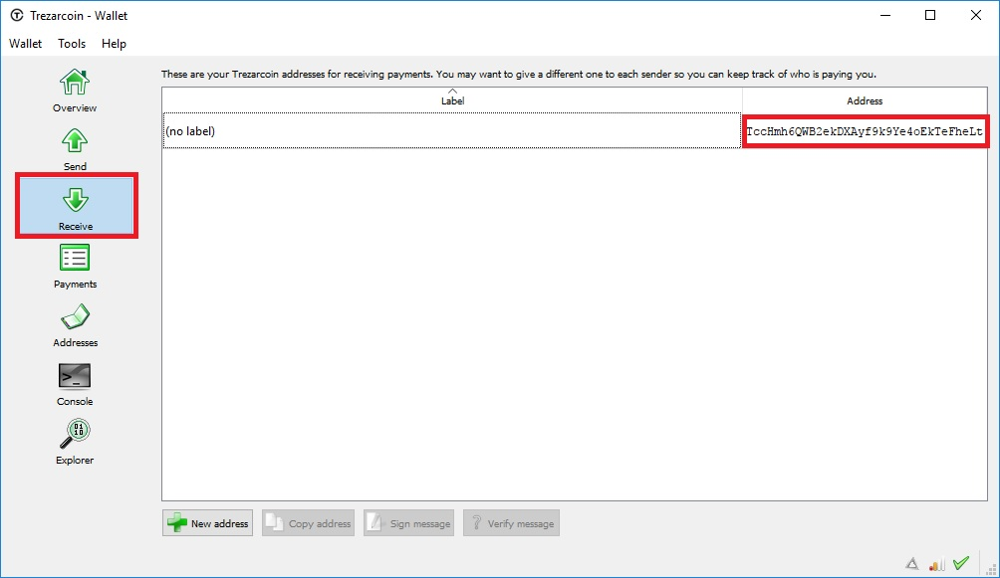
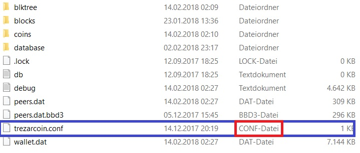

# Pool Mining  

## Download the wallet and get your TZC address

[Windows](https://github.com/TrezarCoin/TrezarCoin/releases/download/v1.0.0.0-tzc/trezarcoin-win32-1.0.0.0.zip "Windows wallet") [MacOs](https://github.com/TrezarCoin/TrezarCoin/releases/download/v1.1.0.0-tzc/trezarcoin-MacOS-1.1.0.0.zip "OSX wallet") [Linux](https://trezarcoin.com/wp-content/uploads/2017/10/linux_PNG5-2-e1507211654199.png "Linux wallet")
[Source](https://github.com/TrezarCoin/TrezarCoin/archive/v1.1.0.0-tzc.tar.gz "Source code")

## Choose your mining software

* [AMD](https://github.com/ghostlander/nsgminer/releases "NSGminer")
* [NVIDIA](https://github.com/tpruvot/ccminer/releases "ccminer")
* [CPU](https://github.com/tpruvot/cpuminer-multi/releases "CPUMiner-Multi")

## Choose your favorite pool

[Pools](https://trezarcoin.com/pools "Trezarcoin pool overview")

This tutorial is made with `altminer.net`

## Miner setup

TZC can be mined via NeoScrypt AlgorithmGPU (CCMiner):
You need to create a .bat file and place it next to your ccminer.exe/sgminer.exe – This .bat file should include following lines:

    ccminer64_65.exe -a neoscrypt -o stratum+tcp://eu1.altminer.net:4233 -u YOURADDRESS -p c=TZC

> Defines:
>
> -a | Defines your algorithm\
> -o | Stratum pool+port\
> -O | Username (your address) : Password

## GPU (NSGminer)

You need to create a .bat file and place it next to your nsgminer.exe – This .bat file should include following lines:

    nsgminer –neoscrypt -o stratum+tcp://eu1.altminer.net:4233 -u YOURADDRESS-p c=TZC -g 1 -w 128 -I 16 –gpu-platform 1 –gpu-engine 950 –gpu-memclock 1500

(Config for R9 280x)

> Defines:
>
> –algorithm | Defines NeoScrypt Algorithm\
> -I -g1 -w | Intensity and Speccs you need to figure out what values work for your card.\
> -o | Stratum pool + port\
> -u | Username ( Your adress )\
> -p | Password (Passwort is for choosing your coin at `altminer.net` )

Here are some configs for the NSGMiner ( Not all are up to date )

https://github.com/Totenfluch/minerx/blob/master/MinerX/src/me/MinerX/Specs.java

## CPU (Cpuminer)

You need to create a .bat file and place it next to your ccminer.exe/sgminer.exe – This .bat file should include following lines:
    cpuminer-gw64-core2.exe -a neoscrypt -t 6 -o stratum+tcp://eu1.altminer.net:4233 -u YOURADDRESS -p c=TZC

> Defines:
>
> -a | Algorithm\
> -o | Stratum pool + port\
> -t  | Intensity ( you need to figure out what values work for you )\
> -u | Username (Your address)\
> -p | Password

## Solo Mining

First you need to create a Trezarcoin.conf File and add it to your /Trezarcoin/Data Folder

Add these lines to your CONF-File:

    irc=0
    dns=1
    qtstyle=2
    daemon=1
    server=1
    listen=1
    stakegen=0
    logtimestamps=1
    minersleep=2000
    stakemindepth=1000
    stakemintime=24
    stakecombine=2000
    stakesplit=4000
    port=17298
    rpcport=17299
    rpcuser=username
    rpcpassword=password
    rpcallowip=127.0.0.*
    addnode=162.217.249.198:17298
    addnode=46.4.0.101:17298

It is important that the file is a CONF-FILE ( RED )

Restart your wallet now and point your miner to your localhost:RPCPort

Commandline for CCminer:

    ccminer64_65.exe -a neoscrypt -o http://127.0.0.1:17299 -u username -p password

Commandline for NSGminer:

    nsgminer –neoscrypt -o 127.0.0.1:17299 -u username -p password

Commandline for CPU Miner:

    cpuminer-gw64-core2.exe -a neoscrypt -o http://127.0.0.1:17299 -u username -p password -t 1