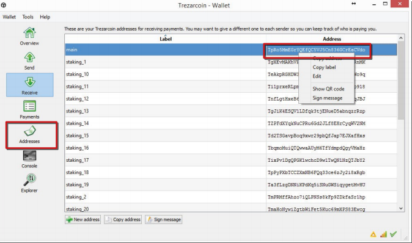
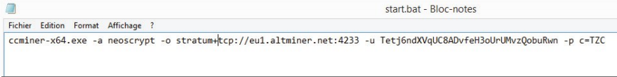
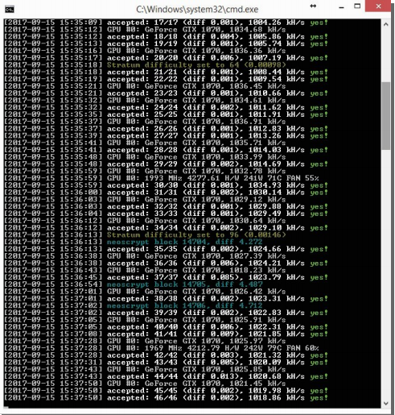
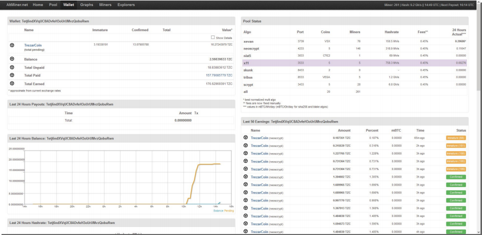
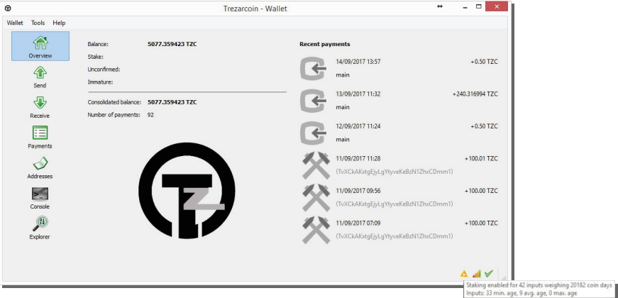

# TZC

## MINING, STAKING & WALLET CONFIGURATION

### PoW & PoS Basics Guide

#### Version 1.1.0.0_01

### What you need

1. A local computer running Ubuntu 16.04, OS X 10.11 (El Capitan), Windows 8.1—or higher.[Note: The examples in this guide will mostly come from Windows 10.]
2. A bit of patience. :)

### What we will see

1. Mining & Staking overview.
2. The trezarcoin.conf file.
3. Pool mining and solo mining.
4. What is staking & how to stake

This guide will not cover every part of the mining/staking topic but it will help you start to understand and will hopefully address the more commonly found issues that may arise. We will use altminer.net as example mining pool in this guide but feel free to use any pool you’re comfortable with.

**Important Note:**
Manual creation of the trezarcoin.conf file is only necessary for wallets prior to version 1.1.0.0. From 1.1.0.0 forward, the wallet will automatically create a trezarcoin.conf file with preset default values; wallet data and wallet.dat will also be located in %appdata%/TrezarCoin instead of the
/data location in prior versions

## 1

### Mining & Staking

Proof-of-Work (PoW) is the more commonly known protocol by which a cryptocurrency blockchain network aims to validate transactions and create new blocks. PoW utilizes computational power—in the form of CPUs, GPUs, and other processing hardware—to solve complicated cryptographic puzzles. When a block is solved, a certain amount of new coins are created and awarded to the miner. TrezarCoin’s PoW protocol employs the ASIC-resistant NeoScrypt algorithm.

Proof-of-Stake (PoS) is another protocol by which a cryptocurrency blockchain network aims to achieve distributed consensus. PoS uses a participant’s coin balance instead of computational power as the key driver for validating transactions.

- When you use your CPU or GPU to solve blocks, you’re mining (PoW).
- When you use your wallet and its coin balance to participate in distributed consensus, you’re staking (PoS).
- When you help the network, either through mining or staking, you’re rewarded with income. :)

## 2

> The way your TrezarCoin wallet interacts with the network can be fine-tuned according to a specific
> configuration file we’re going to create: trezarcoin.conf

Download the TrezarCoin wallet here according to your operating system and launch it once. It’ll generate a /data folder (post-1.1.0.0 versions will generate a %appdata%/TrezarCoin folder). We need to create a new text file in this folder. Save it as trezarcoin.conf and edit it like this:

```bash
irc=0
dns=1
qtstyle=2           #choose wallet skin: 1 or 2
daemon=1
server=1
listen=1
stakegen=1          #stakegen: enable(1) or disable(0) staking(PoS)
logtimestamps=1
minersleep=2000
stakemindepth=1000
stakemintime=24     #stakemintime: Hours an input needs to mature before staking
stakecombine=2000
stakesplit=4000
port=17298
rpcport=17299
rpcuser=username
rpcpassword=password
rpcallowip=127.0.0.*
addnode=162.217.249.198:17298
addnode=46.4.0.101:17298
```

Please verify that the trezarcoin.conf file is:
A) The correct file type--.conf not .txt or anything else.
B) Located in the proper directory—either /data or %appdata%/TrezarCoin depending on your wallet version.

> Your wallet is now ready. :)

Here’s a list of nodes you can add to your trezarcoin.conf file to improve your wallets connectivity to the network:

    addnode=185.213.210.221:53740
    addnode=188.242.118.114:37285
    addnode=162.217.249.198:55383
    addnode=116.100.160.65:64046
    addnode=14.226.75.73:53267
    addnode=109.124.238.30:17298
    addnode=71.90.76.105:17298
    addnode=67.166.32.31:17298
    addnode=195.80.169.31:17298
    addnode=76.173.55.64:17298
    addnode=62.210.137.161:17298
    addnode=96.234.157.221:17298
    addnode=173.66.0.213:17298
    addnode=176.159.60.61:17298
    addnode=213.5.46.28:17298
    addnode=195.58.249.107:17298
    addnode=66.186.247.121:17298
    addnode=94.181.94.119:17298
    addnode=96.40.33.78:17298
    addnode=98.168.217.196:17298
    addnode=98.199.22.255:17298
    addnode=178.165.68.219:17298
    addnode=185.39.74.210:59297
    addnode=109.232.227.133:63397
    addnode=116.105.206.34:57699

## 3

> First of all, you will need your wallet address. Launch your wallet, click on receive to list your addresses\
> Right-click on an address to select *copy* allowing you to paste it as needed



To be able to mine we will need a dedicated miner program. You can mine on CPUs and GPUs; due to the different architectures the miner we are going to use depends on your hardware.

- For mining on Nvidia GPUs: CCminer
    There are different builds of CCminer, we will use the 2.2 one from tpruvot in this guide, feel free to try others and choose the one that will perform the best on your rig. Other popular Nvidia miners include the KlausT ccminer, excavator, and hsrminer and its variants.

- For mining on AMD GPUs: NSGminer
    There are many other AMD-friendly miners available as well, including Claymore’s AMD Neoscrypt miner.

- For mining on CPUs: CPUminer or NSGminer

 ***
**Note:** Although it is possible, it is not recommended to mine TZC with your CPU. A high-end 8-core/16-thread CPU won't be able to match a low-cost GPU's speed and hundreds of threads. Most likely it will cost you more in electricity/CPU-lifespan, than you will earn. Always remember to consider power and other costs.
 ***

> Create a *start.txt* file (we will be changing it to .bat filetype later) and edit it with notepad to include your chosen miner along with any necessary parameters, as well as your wallet address if appropriate. Some pools will take login credentials instead of a wallet address:


- NSGminer (AMD cards and CPU):
  - GPU Solo mining
    ```config
    nsgminer 0 --neoscrypt -C --cpu-threads <nb of cores> -o 127.0.0.1:17299 -O YOUR_USERNAME:YOUR_STRONG_PASSWORD
    ```
  - Pool Mining
    ```config
    nsgminer --neoscrypt -C --cpu-threads <nb of cores> -o stratum+tcp://eu1.altminer.net:4233 -u YOUR_WALLET_ADDRESS -p=TZC
    ```
  - CPU Solo mining
    ```config
    nsgminer 0 --neoscrypt -g -o 127.0.0.1:17299 -O YOUR_USERNAME:YOUR_STRONG_PASSWORD
    ```
  - Pool Mining
    ```config
    nsgminer --neoscrypt -g -o stratum+tcp://eu1.altminer.net:4233 -u YOUR_WALLET_ADDRESS -p c=TZC
    ```
- CPUminer:
  - Solo mining
    ```config
    cpuminer-aes-avx2 -a neoscrypt -t 6 -o 127.0.0.1:17299 -u YOUR_USERNAME -p YOUR_STRONG_PASSWORD
    ```
  - Pool Mining
    ```config
    cpuminer-aes-avx2 -a neoscrypt -t 6 -o stratum+tcp://eu1.altminer.net:4233 -u YOUR_WALLET_ADDRESS -p=TZC
    ```
- CCminer (Nvidia Cards):
  - Solo mining
    ```config
    ccminer-x64.exe -a neoscrypt -o http://127.0.0.1:17299 -u YOUR_USERNAME -p YOUR_STRONG_PASSWORD
    ```
  - Pool Mining
    ```config
    ccminer-x64.exe -a neoscrypt -o stratum+tcp://eu1.altminer.net:4233 -u YOUR_WALLET_ADDRESS -p c=TZC
    ```



> Once edited, save the file and change the .txt extension to .bat. This will allow Windows to execute it.
> Above is an example of a .bat file using CCminer.
>
> -a is the algorithm you’re telling the miner to use\
> -o is the address of the pool you’re mining on—this is provided by the pool (see their help/main page).\
> -u is the user address. Here its your wallet address. It can also be an account.worker name, depending on
> the pool type.\
> -p is your password. altminer doesn’t use an account and the password field is used to identify which
> Neoscrypt currency is mined.
 ***

After editing and changing the extension to .bat, you can now execute the file to start the miner.
It is often helpful to launch the .bat file from a command prompt rather than simply double-clicking it. This will allow you to see errors if it quits instead of having the command window immediately disappear.



Your cmd window should look similar to this. You can check your accepted shares and your hashrate here. If shares are refused and/or your hashrate is lower than expected, you should check your software configuration and your CPU/GPU settings and temperatures.



On the altminer pool you can monitor your mining stats by using the URL below:

```config
    https://altminer.net/?address=YOUR_WALLET_ADDRESS
```

## 4

Staking (PoS) is an automatic process that will start as soon as your inputs are mature. There are minor optimizations
available by tweaking the trezarcoin.conf file. This guide isn’t meant to provide a full tutorial about how to stake, which depends both on how many coins you have and on the overall network PoS difficulty. We will simply provide some
useful information to help you get everything set up.

In order to stake, your wallet must remain open. The time before your inputs start to stake is related to your
configuration file (the minimum is 24 hours). Once an input reaches this "age", your wallet will begin to use it for
staking. The more time that passes, the more your inputs weigh; increasing your staking chances.

The more coins you have and the longer they remain unmoved in your wallet, the more chance you have to hit a PoS block. The maximum age for an input is 16 days. After this time, it will stop increasing in weight. If you alter/consume the inputs (e.g., send a payment), any input included in the transaction will have its time reset to 0. So it may be beneficial for you to have a regular wallet and a PoS wallet. You can follow the Local Wallet + PoS Headless Wallet on VPS guide as an example for setting up such a wallet.

- Staking is based on luck and network difficulty. It’s a game of patience. After an input is rewarded with a PoS block, its age is reset to 0 and it will have to wait at least 24 hours to be eligible to stake again.

- Additionally, if the input is bigger than the stakesplit value and if its age is not at max (16 days) it will split into two halves. For example, if an input of 100,000 coins hits a PoS block before its coin age is 16 days, it will split into two 50,000 inputs and the age for both will be 0.

- This autosplit behavior repeats until the inputs are below the stakesplit value in your trezarcoin.conf.

- The important value is your inputs’ weighting. Now, be patient. :)



The grey penrose triangle icon on the bottom right of your wallet is your staking status. It will turn yellow/orange when staking is enabled. The time before this happens is related to your configuration file (the minimum is 24 hours).

If you hover your cursor over the triangle, it will display your input weighting which is the PoS equivalent to
a PoW mining hashrate.

 ***

               Thanks to crofy and the community for the staking info

 ***

Happy PoW/PoS mining :)